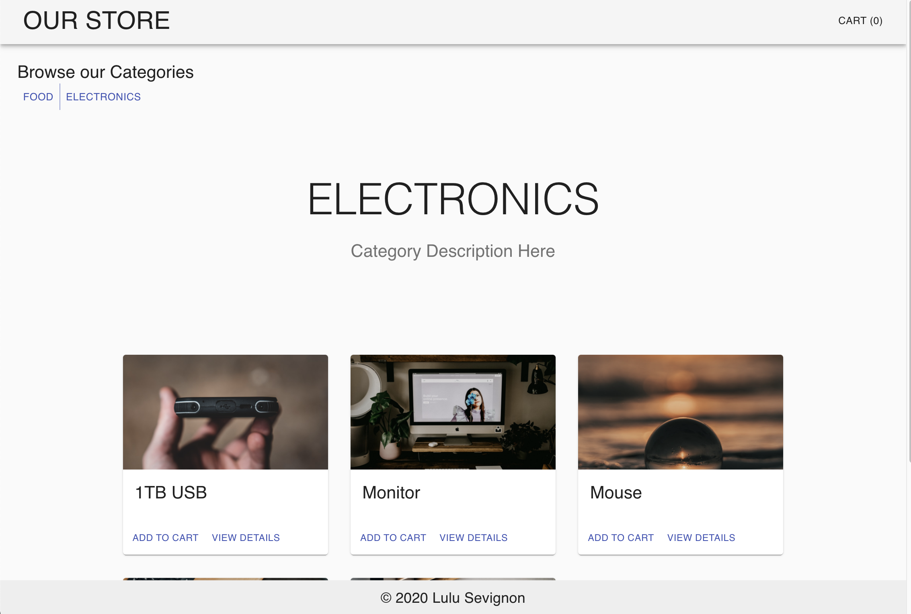

  

# Storefront

## Author 
Lulu Sevignon

## Business Requirements
Our application will power an online storefront that will allow our users to browse our product offerings by category, place items in their shopping cart, and check-out when they are ready to make their purchase

## Key features

- Display a list of our product categories
- Display a listing of products for each category, when the category is selected
- From the product listings:
    - Click to view a full detail page about the product
    - Add the product to your shopping cart
- Shopping cart always visible on screen
- Full shopping cart and check out screen available from main navigation

## Technical requirements

- React
- ES6 Classes
- Redux Store for Application State
- Deployed API with Mongo storage for storing categories and products
- Axios for performing API Requests
- Material UI for layout and styling

### Phase 1 Requirements

- As a user, I expect to see a list of available product categories in the store so that I can easily browse products
- As a user, I want to choose a category and see a list of all available products matching that category
- As a user, I want a clean, easy to use user interface so that I can shop the online store with confidence

### Phase 2 Requirements

- As a user, I want to choose from products in the list and add them to my shopping cart
- As a user, I want to see the products that I’ve added to my shopping cart so that
- As a user, I want to change the quantity of items I intend to purchase in my shopping cart
- As a user, I want to be able to remove an item from my shopping cart

### Phase 3 Requirements

- As a user, I want to interact with live inventory so that I have confidence that the displayed products are in stock
- As a user, I want to know to that when I add an item to my cart, that it is removed from inventory so that no other users can purchase it

## Setup

- Clone down this repo locally
- Turn on local server using `npm start` command